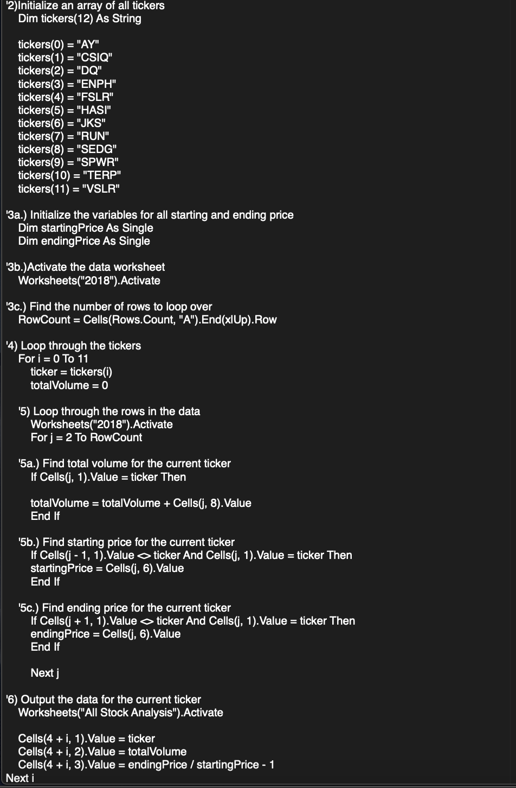
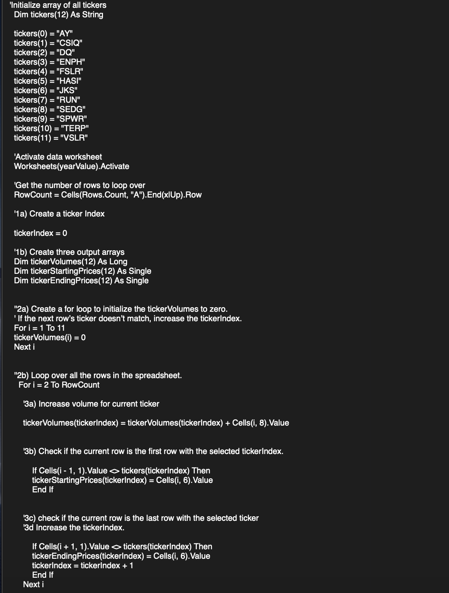
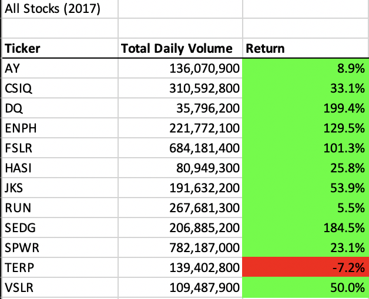

# Stock-Analysis
## Project Overview
Steve has asked us to analyze an array of stocks in addition to the green energy stock DQ for his parents; he would like an analysis on how other green energy stocks fared in comparison to one another. In order to analyze this data, I have employed the Visual Basic Application in Excel to find the stock’s annual return value as well as total daily volume using the worksheet Steve has provided us with the 2017 and 2018 stock data. Upon completing this analysis, Steve and his parents will be able to decipher if DQ is the most successful green energy stock to invest in.

## Purpose
The purpose of this analysis is to provide Steve with a fast and efficient way to analyze the stock market over the past couple of years using VBA. While we generated a workbook for him using VBA that showcased a comparison of a dozen stocks, when analyzing a much larger data set it became apparent that the current code, we were using could be refactored to create a more efficient way of working with the larger data set. This project will determine if the refactored code proves to be more proficient than the code we had originally used. 

# Results
## Original Code
In order to improve upon our original code, it was essential that we reformed the nesting order of our loops. The image below illustrates our original code that featured; ticker, totalVolume, StartingPrice, and EndingPrice as variables that functioned separately throughout each ticker array. 

## Attached are the run times associated with the original code. 
.png)
.png)

## Refactored Code
For the purpose of improving upon this code and therefore making it more efficient four separate arrays were created; tickers, tickerVolumes, tickerStartingPrices, and tickerEndingPrices. The first array “tickers” was established to represent the ticker symbol attributed to a given stock, in doing so the other three arrays mentioned previously were conjoined with the ticker array to create a tickerIndex variable. This variable allowed us to assign the tickerVolumes,tickerStartingPrices as well as tickerEndingPrices to each respective ticker previous to iterating through the data set. The code below illustrates the refactored code, and the establishment of the tickerIndex. 

## Attached are the run times associated with the refactored code. 
.png)
.png)

As can be observed from the comparison of the original code run times and the refactored code run times the analysis runs significantly faster by using the refactored code and therefore the tickerIndex. More specifically, the refactored code runs approximately five seconds faster than the original. 

## Stock Performance
Overall, while analyzing the stock’s performance it is important to note that the stock returns in 2017 were considerably higher than in 2018, which is accompanied by a significant increase in the total daily volume of stocks in 2018 from 2017 respectively. Specifically, DQ experienced a significant decrease in return following 2017 which may be attributed to its increased total daily volume being higher in 2018 than in the previous year.  

.png)
